</img>

<table align="right">
  <tr><td>&#x1F1EC;&#x1F1E7; <a href="README.md">English</a></td></tr>
  <tr><td>&#x1F1F7;&#x1F1FA; <a href="README_ru.md">Russian</a></td></tr>
</table>

### About Me

&nbsp;&nbsp;&nbsp; :briefcase: &nbsp;**Work**\
&nbsp;&nbsp;&nbsp; • Focus on code quality and testing.\
&nbsp;&nbsp;&nbsp; • Automate routine processes to eliminate repetitive work.\
&nbsp;&nbsp;&nbsp; • Advocate for predictable code: less magic, more explicit decisions.\
&nbsp;&nbsp;&nbsp; • Passionate about improving and refactoring inefficient systems.

&nbsp;&nbsp;&nbsp; :house_with_garden: &nbsp;**Personal**\
&nbsp;&nbsp;&nbsp; • Always learning new technologies and engineering approaches.\
&nbsp;&nbsp;&nbsp; • Enjoy outdoor activities and cooking :cook: .\
&nbsp;&nbsp;&nbsp; • Building a home lab with three servers using [Immich](https://immich.app/) and [Nextcloud](https://nextcloud.com/) for my family.

  

  &nbsp;&nbsp;
  &nbsp;&nbsp;
  

  
<b>:computer: &nbsp;Professional tech stack</b>

   

**Languages**\
&nbsp;
&nbsp;\
**Frameworks**\
&nbsp;
&nbsp;\
**Databases**\
&nbsp;
&nbsp;
&nbsp;
&nbsp;\
**Message brokers**\
&nbsp;
&nbsp;\
**Testing**\
&nbsp;
&nbsp;
&nbsp;
&nbsp;
&nbsp;
&nbsp;
&nbsp;
&nbsp;\
**Infrastructure and Observability**\
&nbsp;
&nbsp;
&nbsp;
&nbsp;
&nbsp;
&nbsp;\
**Other technologies**\
&nbsp;
&nbsp;
&nbsp;
&nbsp;
&nbsp;
&nbsp;

**OS**\
&nbsp;
&nbsp;

  
<b>:brain: &nbsp;Technologies I use beyond work</b>

   

&nbsp;
&nbsp;
&nbsp;
&nbsp;
&nbsp;
&nbsp;
&nbsp;

  

